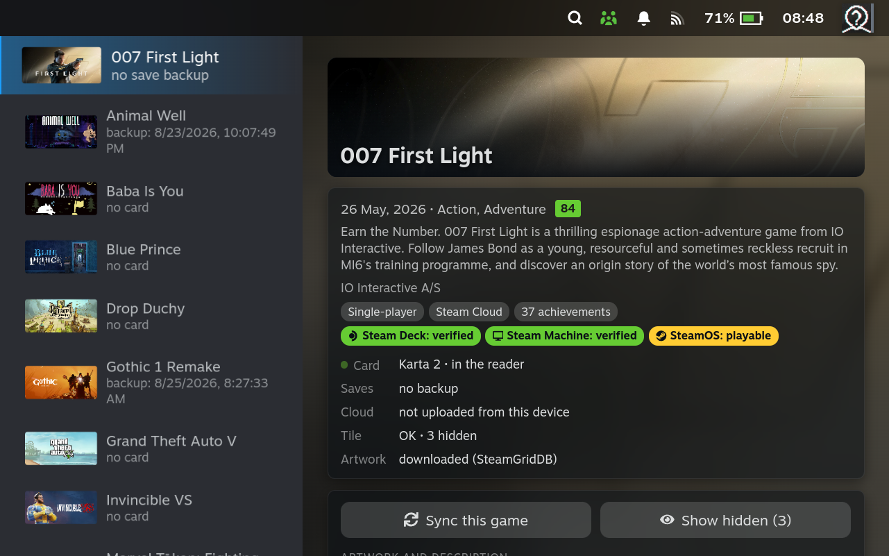
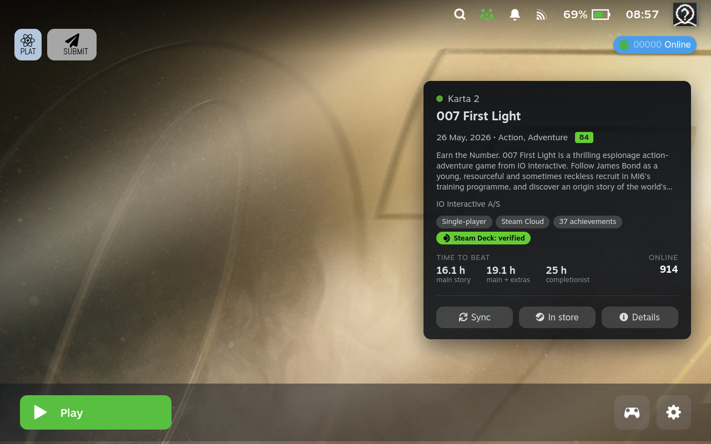
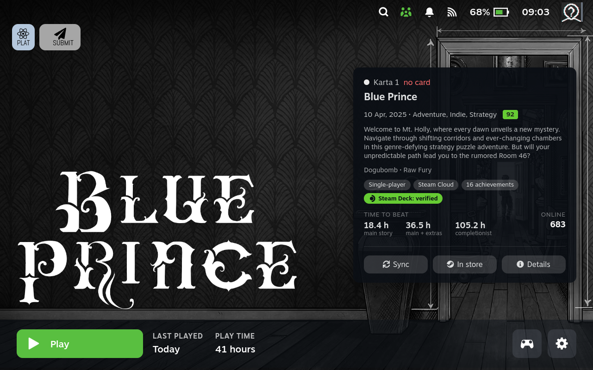
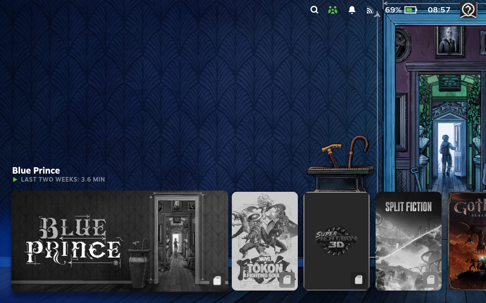
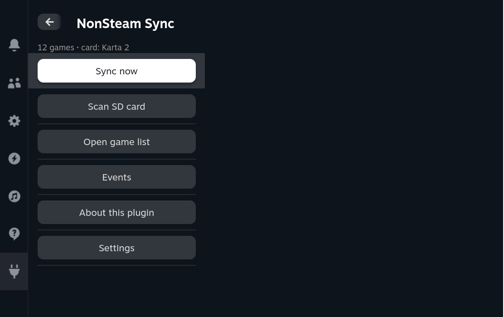
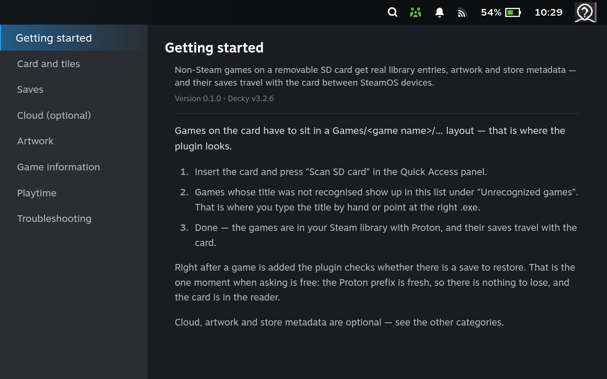
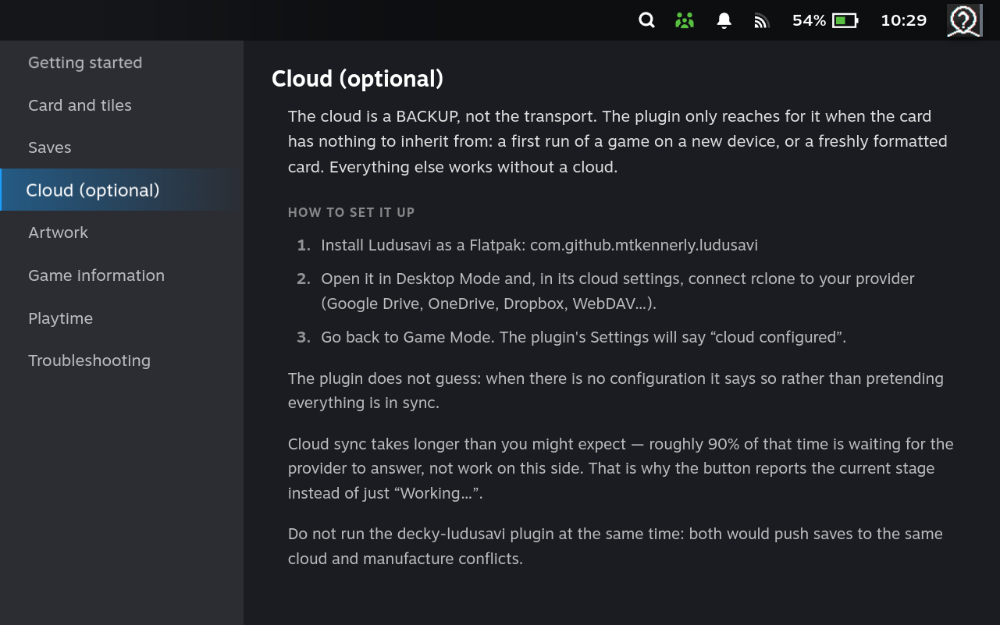
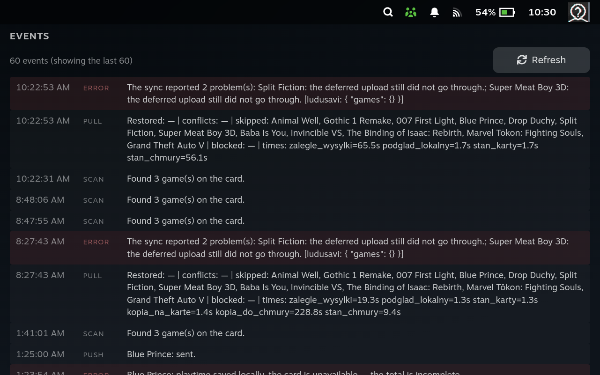

# NonSteam Sync

A [Decky Loader](https://github.com/SteamDeckHomebrew/decky-loader) plugin for
**non-Steam games kept on a removable SD card** that travels between SteamOS
devices — a Steam Deck and a Steam Machine, two Decks, a Deck and a desktop
SteamOS box.

Insert the card, press Play. The save is where it should be.



> **Status:** works on real hardware, still in testing. Not on the Decky plugin
> store yet — install from [Releases](../../releases). Interface is available in
> English and Polish, picked up from your Steam language.

## What it does

- **Scans the card** and adds the games it finds to your Steam library as
  shortcuts — from Game Mode, without dropping to Desktop Mode and without
  hand-picking executables.
- **Picks the game executable** for you (skipping installers, redists and crash
  handlers) and **resolves the canonical title** from the
  [Ludusavi](https://github.com/mtkennerly/ludusavi) database, because save
  detection hangs off that title. You can override both by hand.
- **Adopts a shortcut you added yourself** instead of creating a second one.
  A new shortcut means a new Proton prefix, which means your existing progress
  gets orphaned — so matching is done on the resolved `.exe` path, and the
  existing shortcut keeps its prefix and its playtime.
- **Sets Proton** on new shortcuts and **fetches grid, hero and logo artwork**
  from [SteamGridDB](https://www.steamgriddb.com/).
- **Carries saves on the card.** A copy lives in `<card>/.sdsync/saves`, so the
  next device inherits it the moment the card goes in — no network needed.
- **Uses your cloud as a backup** (Ludusavi + rclone: Google Drive, OneDrive,
  Dropbox, WebDAV…). The cloud is only consulted when the card has nothing to
  inherit from — a first run on a new device, or a freshly formatted card.
  Without a configured cloud the plugin still works.
- **Shows conflicts instead of overwriting.** When a save has drifted, you get
  all three timestamps — in the game, on the card, in the cloud — and you decide.
- **Fills in the empty game page.** A non-Steam shortcut has no store data, so
  the plugin adds release date, description, genres, publisher, Metacritic score,
  hardware compatibility, current player count and
  [HowLongToBeat](https://howlongtobeat.com) completion times. Fetched on demand,
  never in the background.


Everything on that card is information Steam has nowhere on the page for a non-Steam
shortcut — the three buttons are there because syncing before you press Play and
reaching the store page would otherwise mean leaving this screen.

- **Tracks playtime itself** and carries the total on the card, so the number on
  the tile is the sum across devices rather than one machine's share.
- **Marks cards on the tile** — a green dot when the card is in the reader, white
  when it isn't, with a greyscale cover so you notice before you press Play.




Above: every game on cards that are not in the reader is greyscale with a white badge.
The one still in colour is on the card currently inserted. You find out before you
press Play, not after Steam fails to find the file.

- **Disables the Steamworks decoy** (`steam_appid.txt`) when adding a game, so
  Steam does not log your session against the store version of that game. This is
  reversible.
- **Explains itself.** An *About this plugin* screen groups every feature into eight
  categories and carries step-by-step setup for the parts that need it — Ludusavi and
  rclone, the SteamGridDB key, the first scan. Reachable from the Quick Access panel.
- **Writes down what it did.** Every operation lands in an event log with its outcome
  and how long it took — the one place that says *why* something failed rather than
  just that it did.

## How it decides where the newest save is

The transport is the **card**, not the cloud. The reason is physical: without the
card you cannot play the game at all, so the card is the only medium that always
holds the newest state — and the only one that needs no network.

One invariant holds the whole design together: **the cloud never receives a state
the card does not have.** Uploads happen only after a successful copy to the card.
If the cloud could get ahead, the second device would see "card unchanged", start
from an older save, and have no way to learn about the newer one.

Copy identity is the `when` field from Ludusavi's `mapping.yaml`, compared **for
equality only**, never for "newer" — so two devices with drifting clocks break
nothing.

## What it does not do

- It does not touch games you bought on Steam, shortcuts you added yourself,
  emulators or launchers. **It only ever moves entries from its own registry.**
- It does not sync while a game is running, and it does not sync before launch.
  Games start immediately; syncing happens on events.
- It does not talk to other devices over the local network. That is deliberate —
  the devices are often on different networks.

## Requirements

- SteamOS with [Decky Loader](https://github.com/SteamDeckHomebrew/decky-loader).
- [Ludusavi](https://github.com/mtkennerly/ludusavi) as a Flatpak
  (`com.github.mtkennerly.ludusavi`). Cloud sync is optional; if you want it,
  configure rclone inside Ludusavi. The plugin detects a missing configuration
  and says so rather than pretending everything is in sync.
- A free [SteamGridDB](https://www.steamgriddb.com/) API key if you want artwork
  (profile → Preferences → API). Without it the plugin works, the tiles just stay
  grey.
- Games laid out on the card as `Games/<game name>/…`.

Do not run [decky-ludusavi](https://github.com/GedasFX/decky-ludusavi) alongside
this plugin — both would push saves to the same cloud and manufacture conflicts.

## Install

1. Grab `NonSteam-Sync.zip` from the [latest release](../../releases/latest).
2. In Decky: **⚙ Settings → Developer mode → Install Plugin from URL**, and paste
   the release asset URL. (Or copy the zip to the device and use a `file://` URL.)
3. Open **NonSteam Sync** in the Quick Access panel and press **Scan SD card**.



Optional, in the plugin's settings: your SteamGridDB API key, interface language,
and where the card dot is drawn on the tile.

Everything else is explained inside the plugin — **About this plugin** in the Quick
Access panel:





When a sync does not go the way you expected, **Events** says what happened and how
long each stage took:



## Development

```bash
uvx pytest tests/ -q     # engine tests, no device needed
pnpm install
pnpm build               # frontend bundle into dist/
pnpm typecheck           # types only — it does not check behaviour
pnpm check               # the runnable frontend checks (needs Node 23+)
```

`pnpm build` reports TypeScript problems as *warnings* and still emits a bundle
with exit code 0. Read its output; a clean exit code is not proof of a clean build.

`pnpm typecheck` checks types, not behaviour. Anything that is a pure function in
`src/*.ts` should leave a check behind in `checks/` — that directory lives outside
`src/` on purpose, so it stays out of `tsc` and needs no extra dependency.

### Layout

| Path | Contents |
|---|---|
| `main.py` | RPC layer: catches exceptions, logs, runs the engine off the event loop |
| `py_modules/sdsync/` | the engine — registry, card scan, titles, saves, cloud, artwork, metadata, playtime |
| `src/` | frontend (TypeScript/React) |
| `src/steam.ts`, `steam-page-patch.tsx`, `steam-badges.tsx`, `steam-game-info.ts` | the **only** four files allowed to touch undocumented Steam APIs |
| `tests/` | engine and RPC tests |
| `tests/fixtures/` | **real** Ludusavi, Steam store and HowLongToBeat responses captured on a device |

All decision logic lives in Python and is testable without hardware — no engine
module imports `decky`, only `main.py` does. The frontend is thin: it does what
exists solely in Steam's API (shortcuts, Proton, hiding, artwork) and renders
backend state.

### Rules this project does not break

1. **A failure must never look like a success.** Exit code 0 proves nothing;
   backup, restore and upload each confirm in Ludusavi's `--api` response that the
   game was processed and has files.
2. **"I don't know" is not "no changes."** Unparsable output, an error code, a
   game missing from the response → unknown state → conflict. Never "all good".
3. **But "no saves" is not "I don't know."** Ludusavi answers `{"games": {}}` with
   exit code 0 for a game with no saves. That is a definite answer.
4. **The saves of a running game are untouchable**, checked twice — at measurement
   and again immediately before restoring.
5. **A safety backup is taken outside the cloud loop before any restore.**
6. **Nothing blocking inside `async def`.** Ludusavi and rclone calls go through
   `asyncio.to_thread`.
7. **Test doubles reproduce measured behaviour**, not convenient assumptions.

## Credits

This stands on other people's work:
[Ludusavi](https://github.com/mtkennerly/ludusavi) (save locations and
versioning), [rclone](https://rclone.org) (transport),
[Decky Loader](https://github.com/SteamDeckHomebrew/decky-loader),
[SteamGridDB](https://www.steamgriddb.com/) and
[HowLongToBeat](https://howlongtobeat.com).

Prior art that shaped parts of this plugin:
[decky-ludusavi](https://github.com/GedasFX/decky-ludusavi) (the starting point),
[SDH-PlayTime](https://github.com/popsUlfr/SDH-PlayTime) (how to make a playtime
number stick on a non-Steam tile),
[decky-nonsteam-badges](https://github.com/mrsteyk/decky-nonsteam-badges) (badges
have to go through the DOM),
[hltb-for-deck](https://github.com/OMGDuke/hltb-for-deck) (HowLongToBeat has no
API and needs a rotating token).

## License

BSD 3-Clause — see [LICENSE](LICENSE).
